# SEMI_G14

### UNIVERSIDAD SAN CARLOS DE GUATEMALA
### FACULTAD DE INGENIERIA
### ESCUELA DE CIENCIAS Y SISTEMAS

### SEMINARIO 1 GRUPO 14

## CREACION PRACTICA NO.1

### Enunciado :point_left:

[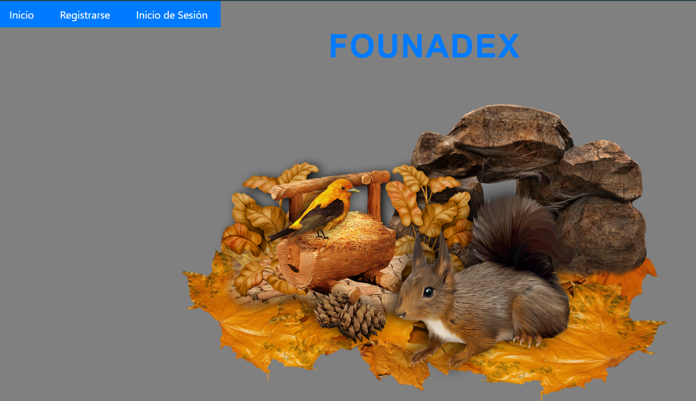](./Img/[SEMI1]Practica2.pdf)

---

1. ### :fire: instacias creadas :fire:

   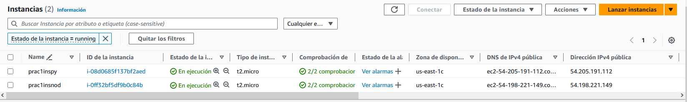

---

2. ### permisos de grupo de seguridad (entrada) :eyes:

     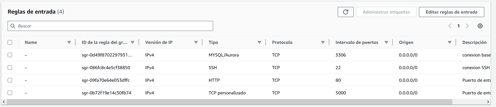
---

3. ### permisos de grupo de seguridad (salida) :eyes:

     
---

4. ### detalles de base de datos utilizada

     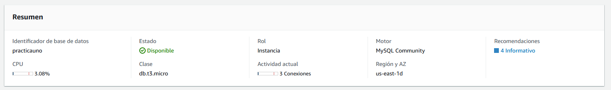
---

5. ### enlace y puerto de base de datos

     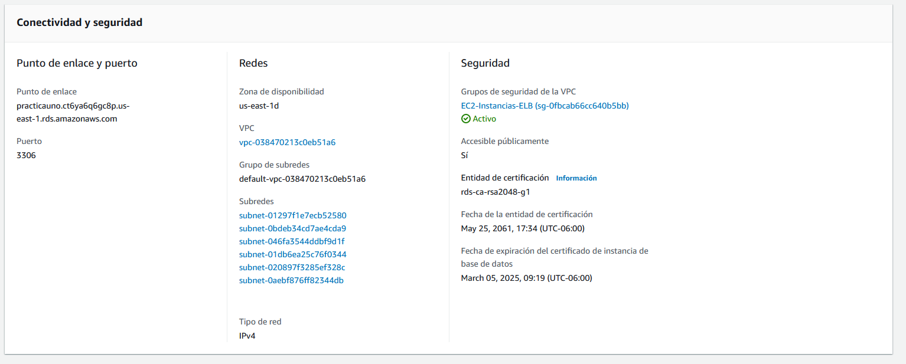
---

6. ### usuarios creados 

     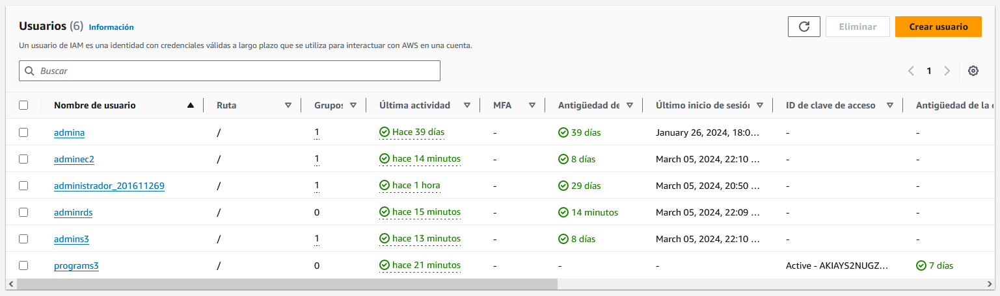
---

7. ### balanceador de carga creado

     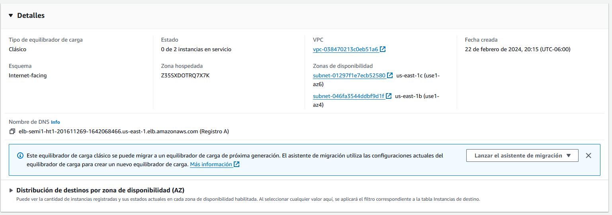
---

8. ### detalles del balanceador de carga

     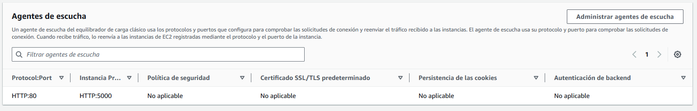
---

9. ### grupo de seguridad utilizado :lock:

     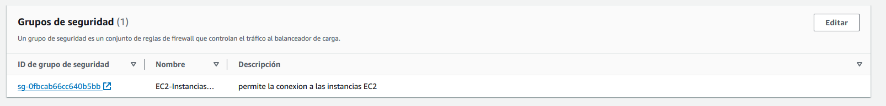
---

10. ### bucket de carga de imagenes

     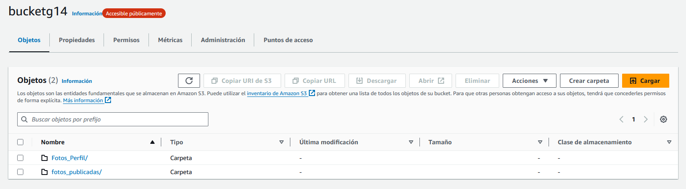
---

11. ### detalles del bucket

     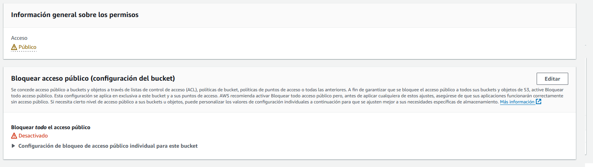
---

12. ### politica creada para sitio web :lock:

     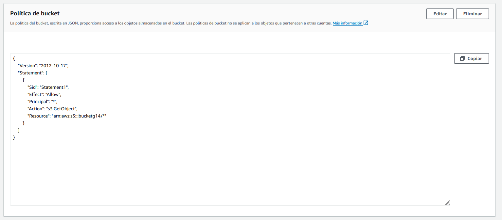
---

13. ### detalles del sitio web

     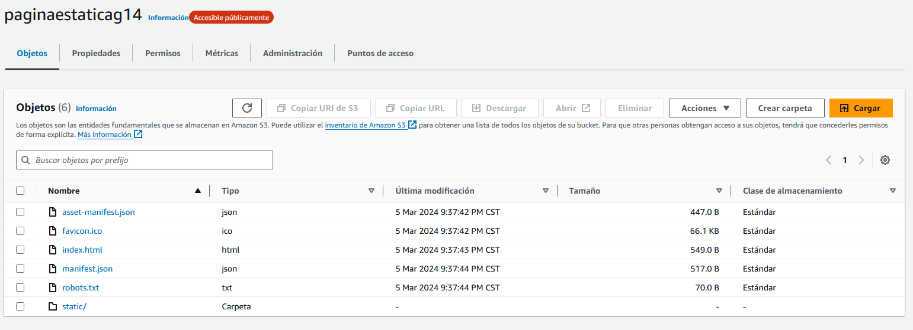
---

14. ### sitio web estatico

     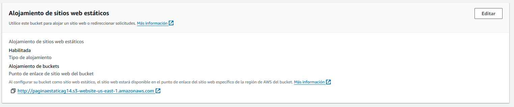
---

15. ### entidad relacion logico 

     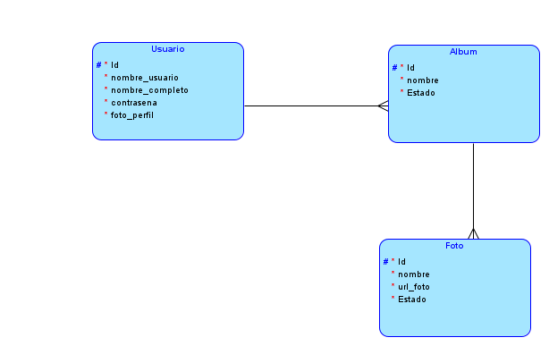
---

16. ### entidad relacion relacional

     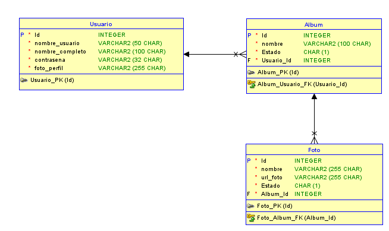
---

####  :rotating_light: INTEGRANTES :rotating_light:

+ Carlos Augusto Hernández Ordoñez - 201611269
+ Jose Luis Reynoso Tiu - 201345126
+ Henrry David Bran Velásquez - 201314439

